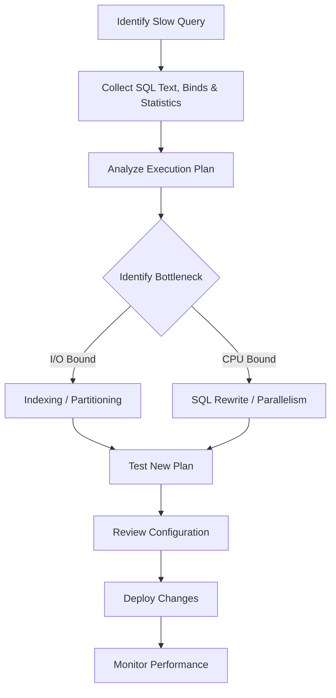

# ⚡ SQL Tuning – Oracle Database


A structured collection of **SQL Tuning concepts, Oracle commands, optimization techniques, and practical SQL examples**.

The purpose of SQL tuning is to improve query performance while reducing unnecessary **CPU, I/O, memory, and database resources**.

---

## 📌 Table of Contents

* [Overview](#-overview)
* [Query Execution Plans](#-query-execution-plans)
* [Indexing Strategies](#-indexing-strategies)
* [Statistics and Histograms](#-statistics-and-histograms)
* [Join Algorithms](#-join-algorithms)
* [Partitioning](#-partitioning)
* [Parallel Execution](#-parallel-execution)
* [Optimizer Hints](#-optimizer-hints)
* [Bind Variables](#-bind-variables)
* [Plan Stability](#-plan-stability)
* [Materialized Views](#-materialized-views)
* [Sorting and Temporary Space](#-sorting-and-temporary-space)
* [I/O vs CPU Bottlenecks](#-io-vs-cpu-bottlenecks)
* [Oracle Monitoring Tools](#-oracle-monitoring-tools)
* [SQL Anti-Patterns](#-common-sql-anti-patterns)
* [SQL Tuning Checklist](#-sql-tuning-checklist)
* [Practical Examples](#-practical-examples)
* [Tuning Workflow](#-sql-tuning-workflow)
* [Key Takeaways](#-key-takeaways)

---

## 🔎 Overview

**SQL Tuning** is the process of improving SQL query performance by selecting efficient execution plans and reducing unnecessary resource consumption.

Major areas covered:

* Execution plan analysis
* Index optimization
* Statistics management
* Join optimization
* Partitioning
* Parallel execution
* Optimizer hints
* Bind variables
* Plan stability
* Materialized views
* SQL monitoring
* Performance bottleneck analysis

---

## 📊 Query Execution Plans

An **execution plan** describes how the Oracle optimizer intends to execute a SQL statement.

It can show:

* Table access paths
* Join order
* Join methods
* Index usage
* Filters
* Estimated rows
* Cost

Oracle uses a **Cost-Based Optimizer (CBO)** to evaluate possible execution plans and select a cost-effective plan based on available statistics.

### EXPLAIN PLAN

```sql
EXPLAIN PLAN FOR
SELECT *
FROM employees
WHERE salary > 10000;

SELECT *
FROM TABLE(DBMS_XPLAN.DISPLAY);
```

### SQL*Plus AUTOTRACE

```sql
SET AUTOTRACE ON;

SELECT *
FROM employees
WHERE department_id = 10;
```

AUTOTRACE can display the execution plan along with execution statistics.

---

## 📇 Indexing Strategies

Indexes can reduce the amount of data Oracle needs to scan.

### 1. B-Tree Index

The default Oracle index type and commonly useful for selective queries.

```sql
CREATE INDEX idx_emp_salary
ON employees(salary);
```

Example:

```sql
SELECT employee_id, first_name, salary
FROM employees
WHERE salary > 10000;
```

B-Tree indexes are particularly useful for columns with many distinct values.

---

### 2. Bitmap Index

Bitmap indexes can be useful for large analytical/data-warehouse workloads with low-cardinality columns.

```sql
CREATE BITMAP INDEX idx_emp_department
ON employees(department_id);
```

They can efficiently combine multiple bitmap conditions, but are generally not the preferred choice for highly concurrent OLTP workloads.

---

### 3. Composite Index

A composite index contains multiple columns.

```sql
CREATE INDEX idx_emp_dept_salary
ON employees(department_id, salary);
```

The order of columns is important because Oracle can make better use of the leading columns.

---

### 4. Covering Index

A covering index contains the columns required by a query so that the database may satisfy the query from the index without accessing the base table.

```sql
CREATE INDEX idx_emp_cover
ON employees(department_id, salary);
```

Example:

```sql
SELECT department_id, salary
FROM employees
WHERE department_id = 10;
```

Covering indexes can improve read performance but increase index size and maintenance cost.

---

## 📈 Statistics and Histograms

Oracle's optimizer relies on statistics to estimate:

* Number of rows
* Number of distinct values
* Data distribution
* Selectivity
* Index characteristics

Statistics should be kept reasonably current because outdated statistics can lead to inefficient execution plans.

### Gather Statistics

```sql
BEGIN
    DBMS_STATS.GATHER_TABLE_STATS(
        ownname => 'HR',
        tabname => 'EMPLOYEES'
    );
END;
/
```

### Histograms

Histograms help the optimizer understand uneven or **skewed data distributions**.

For example, if one department contains most employees while others contain very few, a histogram can help the optimizer make better selectivity estimates.

---

## 🔗 Join Algorithms

Oracle may choose different join algorithms depending on data size, indexes, statistics, and estimated costs.

### Nested Loops Join

Useful when the outer table produces a small number of rows and the inner table has an appropriate index.

```sql
SELECT e.last_name,
       d.department_name
FROM employees e
JOIN departments d
ON e.department_id = d.department_id;
```

Force a nested loops join for testing:

```sql
SELECT /*+ USE_NL(e d) */
       e.last_name,
       d.department_name
FROM employees e
JOIN departments d
ON e.department_id = d.department_id;
```

---

### Hash Join

Hash joins are useful for large, unsorted datasets, particularly equality joins.

```sql
SELECT e.last_name,
       d.department_name
FROM employees e
JOIN departments d
ON e.department_id = d.department_id;
```

Oracle may choose a hash join automatically when its cost model considers it appropriate.

---

### Sort-Merge Join

Sort-merge joins operate on sorted inputs.

```sql
SELECT /*+ USE_MERGE(e d) */
       e.last_name,
       d.department_name
FROM employees e
JOIN departments d
ON e.department_id = d.department_id;
```

Sorting can increase CPU and temporary-space usage when inputs are not already appropriately ordered.

---

## 🗂️ Partitioning

Partitioning divides large tables into smaller logical pieces.

Common approaches include:

* Range partitioning
* List partitioning
* Hash partitioning

### Example

```sql
CREATE TABLE sales (
    sale_id     NUMBER,
    sale_date   DATE,
    amount      NUMBER
)
PARTITION BY RANGE (sale_date)
(
    PARTITION sales_2025
        VALUES LESS THAN (DATE '2026-01-01'),

    PARTITION sales_2026
        VALUES LESS THAN (DATE '2027-01-01')
);
```

### Partition Pruning

When a query filters using the partition key, Oracle may access only the relevant partitions instead of scanning the entire table.

```sql
SELECT *
FROM sales
WHERE sale_date >= DATE '2026-01-01'
  AND sale_date <  DATE '2027-01-01';
```

Partition pruning can significantly reduce the amount of data scanned in large tables.

---

## ⚡ Parallel Execution

Parallel execution allows large database operations to use multiple processes/threads.

It can be useful for:

* Large table scans
* Large joins
* Aggregations
* Bulk operations
* Data warehouse workloads

Example:

```sql
SELECT /*+ PARALLEL(e, 4) */
       COUNT(*)
FROM employees e;
```

Parallelism should be used carefully because excessive parallel execution can increase CPU, I/O, memory, and contention.

---

## 💡 Optimizer Hints

Hints provide instructions to the Oracle optimizer.

### Index Hint

```sql
SELECT /*+ INDEX(e emp_salary_idx) */
       *
FROM employees e
WHERE salary > 10000;
```

### Full Table Scan Hint

```sql
SELECT /*+ FULL(e) */
       *
FROM employees e;
```

### Nested Loops Hint

```sql
SELECT /*+ USE_NL(e d) */
       e.last_name,
       d.department_name
FROM employees e
JOIN departments d
ON e.department_id = d.department_id;
```

Hints should be used carefully because they can become inappropriate when data, statistics, schema, or system conditions change.

---

## 🔄 Bind Variables

Bind variables allow values to be supplied separately from the SQL statement.

```sql
VARIABLE v_dept NUMBER;

EXEC :v_dept := 10;

SELECT employee_id,
       first_name,
       salary
FROM employees
WHERE department_id = :v_dept;
```

Benefits include:

* Reduced parsing overhead
* Better cursor reuse
* Useful for frequently executed SQL

However, generic cardinality estimates can sometimes affect plan quality.

---

## 📌 Plan Stability

Execution plans can change because of:

* Statistics updates
* Schema changes
* Data distribution changes
* Parameter changes
* Database version changes

Oracle provides **SQL Plan Management** and **SQL Plan Baselines** to help prevent unwanted plan regressions.

### View SQL Plan Information

```sql
SELECT sql_id,
       plan_hash_value,
       executions,
       elapsed_time
FROM v$sql
WHERE sql_text LIKE '%employees%';
```

---

## 🧮 Materialized Views

Materialized views store precomputed query results.

They can be useful for expensive:

* Joins
* Aggregations
* Reporting queries
* Data warehouse workloads

### Example

```sql
CREATE MATERIALIZED VIEW mv_dept_salary
BUILD IMMEDIATE
REFRESH COMPLETE
ON DEMAND
AS
SELECT department_id,
       SUM(salary) AS total_salary,
       AVG(salary) AS avg_salary
FROM employees
GROUP BY department_id;
```

A materialized view can reduce the cost of repeatedly calculating expensive aggregations, at the cost of storage and refresh operations.

---

## 💾 Sorting and Temporary Space

Operations such as:

```sql
ORDER BY
GROUP BY
DISTINCT
UNION
```

may require sorting or temporary space.

Example:

```sql
SELECT *
FROM employees
WHERE salary > 10000
ORDER BY last_name;
```

If sorting cannot be performed efficiently in memory, temporary space may be used.

### Avoid Unnecessary Sorting

Instead of:

```sql
SELECT DISTINCT department_id
FROM employees;
```

Do not use `DISTINCT` unless duplicate elimination is actually required.

---

## 🖥️ I/O vs CPU Bottlenecks

### I/O Bottleneck

Common causes:

* Full table scans
* Missing indexes
* Poor data access patterns
* Insufficient caching

Possible solutions:

* Appropriate indexes
* Partitioning
* Better filtering
* Memory optimization
* Faster storage

### CPU Bottleneck

Common causes:

* Complex calculations
* Large joins
* Excessive sorting
* Inefficient SQL expressions

Possible solutions:

* Rewrite SQL
* Reduce unnecessary rows
* Optimize joins
* Improve indexes
* Consider parallel execution

The notes emphasize identifying whether a workload is primarily I/O-bound or CPU-bound before choosing a tuning strategy.

---

## 🔍 Oracle Monitoring Tools

### 1. EXPLAIN PLAN

```sql
EXPLAIN PLAN FOR
SELECT *
FROM employees
WHERE department_id = 10;

SELECT *
FROM TABLE(DBMS_XPLAN.DISPLAY);
```

### 2. AUTOTRACE

```sql
SET AUTOTRACE ON;

SELECT *
FROM employees
WHERE department_id = 10;
```

### 3. SQL Trace

```sql
ALTER SESSION SET SQL_TRACE = TRUE;
```

After running the required SQL:

```sql
ALTER SESSION SET SQL_TRACE = FALSE;
```

### 4. TKPROF

TKPROF can format SQL trace information and help analyze:

* CPU time
* Reads
* Executions
* Rows processed

### 5. AWR and ASH

AWR and ASH can help identify:

* High-resource SQL
* CPU usage
* Wait events
* Historical workload behavior

The uploaded notes identify AWR/ASH as Oracle performance monitoring tools and mention that their availability depends on the relevant Oracle licensing.

---

## 🚫 Common SQL Anti-Patterns

### ❌ Avoid `SELECT *`

```sql
SELECT *
FROM employees;
```

Prefer:

```sql
SELECT employee_id,
       first_name,
       salary
FROM employees;
```

---

### ❌ Avoid Functions on Indexed Columns

Potentially problematic:

```sql
SELECT *
FROM employees
WHERE UPPER(last_name) = 'KING';
```

Applying functions to columns can prevent normal index usage unless an appropriate function-based indexing strategy is used.

---

### ❌ Avoid Implicit Conversions

Problematic:

```sql
WHERE varchar_column = 123
```

Prefer comparing compatible data types.

---

### ❌ Avoid Unnecessary DISTINCT

```sql
SELECT DISTINCT department_id
FROM employees;
```

Use `DISTINCT` only when duplicate removal is required.

---

### ❌ Avoid Cartesian Products

Incorrect:

```sql
SELECT *
FROM employees e,
     departments d;
```

Prefer:

```sql
SELECT e.employee_id,
       e.last_name,
       d.department_name
FROM employees e
JOIN departments d
ON e.department_id = d.department_id;
```

---

### ❌ Avoid Row-by-Row Processing

Repeated row-by-row operations can be slower than set-based SQL.

Prefer:

```sql
UPDATE employees
SET salary = salary * 1.10
WHERE department_id = 10;
```

instead of processing every row individually.

The source notes identify unnecessary `SELECT *`, functions on columns, implicit conversions, Cartesian products, row-by-row processing, over-indexing, and outdated statistics as common SQL performance anti-patterns.

---

## ✅ SQL Tuning Checklist

### 1. Identify the Problem

* Find the slow SQL statement.
* Collect SQL text and execution information.

### 2. Check the Execution Plan

Look for:

* Full table scans
* Inefficient join methods
* Unexpected join order
* Large estimated row counts
* High-cost operations

### 3. Check Indexes

Verify:

* WHERE columns
* JOIN columns
* Composite-index column order
* Unnecessary indexes

### 4. Check Statistics

```sql
SELECT *
FROM user_tab_statistics
WHERE table_name = 'EMPLOYEES';
```

Gather statistics when appropriate:

```sql
BEGIN
    DBMS_STATS.GATHER_TABLE_STATS(
        ownname => USER,
        tabname => 'EMPLOYEES'
    );
END;
/
```

### 5. Rewrite the Query

Consider:

* Removing unnecessary columns
* Removing unnecessary sorting
* Simplifying joins
* Replacing inefficient subqueries where appropriate
* Reducing unnecessary processing

### 6. Test and Measure

Compare:

* Execution time
* Logical reads
* Physical reads
* CPU usage
* Execution plans

### 7. Monitor After Deployment

Tuning should be an iterative process rather than a one-time activity.

---

## 🧪 Practical SQL Tuning Examples

### Example 1 – Adding an Index

#### Before

```sql
SELECT *
FROM employees
WHERE hire_date > DATE '2020-01-01';
```

#### Create Index

```sql
CREATE INDEX emp_hire_dt_idx
ON employees(hire_date);
```

#### Test with Index Hint

```sql
SELECT /*+ INDEX(employees emp_hire_dt_idx) */
       *
FROM employees
WHERE hire_date > DATE '2020-01-01';
```

The source example demonstrates how adding an index can change the access path toward an index range scan.

---

### Example 2 – Join Method

#### Default Query

```sql
SELECT e.last_name,
       d.department_name
FROM employees e
JOIN departments d
ON e.department_id = d.department_id;
```

#### Force Nested Loops

```sql
SELECT /*+ USE_NL(e d) */
       e.last_name,
       d.department_name
FROM employees e
JOIN departments d
ON e.department_id = d.department_id;
```

The source example compares a plan using a hash join with one using a forced nested-loops join, demonstrating that changing a join method can significantly affect estimated cost.

---

## 🔄 SQL Tuning Workflow



The overall workflow follows the source material: identify the issue, gather information, analyze the plan, determine the bottleneck, apply a suitable optimization, test, deploy, and monitor.

---

## 📚 Key Takeaways

> **Good SQL tuning is evidence-driven.**

Before changing a query, understand:

* What the execution plan is doing
* Where the database spends its resources
* Whether the problem is CPU or I/O
* Whether statistics are accurate
* Whether indexes are appropriate
* Whether the join strategy is suitable
* Whether partitioning can reduce data access
* Whether parallelism is appropriate
* Whether the execution plan remains stable

The objective is not simply to add indexes or hints. The objective is to find the **right optimization for the actual workload**.

---

## 🛠️ Technologies & Tools

| Technology / Tool   | Purpose                         |
| ------------------- | ------------------------------- |
| Oracle Database     | Database platform               |
| SQL                 | Query language                  |
| PL/SQL              | Procedural database programming |
| EXPLAIN PLAN        | Execution plan analysis         |
| DBMS_XPLAN          | Plan display and analysis       |
| AUTOTRACE           | Plan and statistics             |
| DBMS_STATS          | Statistics management           |
| SQL Trace           | SQL performance tracing         |
| TKPROF              | Trace analysis                  |
| AWR                 | Historical performance analysis |
| ASH                 | Active session analysis         |
| SQL Plan Management | Plan stability                  |

---

## 📖 Learning Focus

This repository is intended for learning and practicing **Oracle SQL performance tuning**, with emphasis on understanding execution plans, indexes, optimizer behavior, joins, statistics, monitoring, and practical performance optimization.

---

⭐ **Keep learning. Keep tuning. Keep optimizing.**
